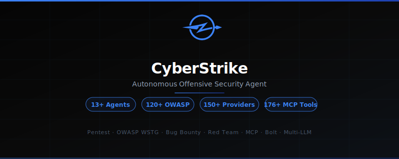

<p align="center">
  <picture>
    <source srcset="assets/social-preview-dark.svg" media="(prefers-color-scheme: dark)">
    <source srcset="assets/social-preview-light.svg" media="(prefers-color-scheme: light)">
    
  </picture>
</p>

<p align="center"><b>Платформа агентов наступательной безопасности на базе искусственного интеллекта.</b></p>

<p align="center">
  <a href="https://www.npmjs.com/package/cyberstrike"></a>
  <a href="https://github.com/CyberStrikeus/CyberStrike/actions/workflows/publish.yml"></a>
  <a href="https://discord.gg/cyberstrike"></a>
  <a href="https://github.com/CyberStrikeus/CyberStrike/blob/dev/LICENSE"></a>
</p>

<p align="center">
  <a href="README.md">English</a> |
  <a href="README.zh.md">简体中文</a> |
  <a href="README.zht.md">繁體中文</a> |
  <a href="README.ko.md">한국어</a> |
  <a href="README.de.md">Deutsch</a> |
  <a href="README.es.md">Español</a> |
  <a href="README.fr.md">Français</a> |
  <a href="README.it.md">Italiano</a> |
  <a href="README.da.md">Dansk</a> |
  <a href="README.ja.md">日本語</a> |
  <a href="README.pl.md">Polski</a> |
  <a href="README.ru.md">Русский</a> |
  <a href="README.bs.md">Bosanski</a> |
  <a href="README.ar.md">العربية</a> |
  <a href="README.no.md">Norsk</a> |
  <a href="README.br.md">Português (Brasil)</a> |
  <a href="README.th.md">ไทย</a> |
  <a href="README.tr.md">Türkçe</a> |
  <a href="README.uk.md">Українська</a> |
  <a href="README.bn.md">বাংলা</a> |
  <a href="README.el.md">Ελληνικά</a> |
  <a href="README.vi.md">Tiếng Việt</a> |
  <a href="README.hi.md">हिन्दी</a>
</p>

---

### Что такое CyberStrike?

CyberStrike — это автономная open-source платформа агентов наступательной безопасности, работающая в терминале. Она включает более 13 специализированных агентов безопасности, более 120 тестовых сценариев OWASP и поддерживает более 15 провайдеров LLM. Укажите цель, и CyberStrike выполнит разведку, обнаружение уязвимостей и генерацию отчётов — всё из единого интерфейса TUI.

### Возможности

- **Более 13 агентов безопасности** — Веб-приложения (OWASP WSTG), мобильные (MASTG/MASVS), облачные (AWS/Azure/GCP), Active Directory/Kerberos, сетевые и 8 специализированных прокси-тестеров (IDOR, инъекции, SSRF, обход аутентификации и другое)
- **Более 30 встроенных инструментов** — Выполнение shell-команд, HTTP-запросы, файловые операции, поиск по коду, веб-скрейпинг, отчётность по уязвимостям
- **Bolt** — Удалённый сервер инструментов с протоколом MCP и сопряжением Ed25519. Запускайте инструменты безопасности на удалённых серверах и управляйте ими из своего терминала
- **Экосистема MCP** — Собственные интеграции: [hackbrowser-mcp](https://github.com/badchars/hackbrowser-mcp), [cloud-audit-mcp](https://github.com/badchars/cloud-audit-mcp), [github-security-mcp](https://github.com/badchars/github-security-mcp), [cve-mcp](https://github.com/badchars/cve-mcp), [osint-mcp](https://github.com/badchars/osint-mcp)
- **Более 15 провайдеров LLM** — Anthropic, OpenAI, Google, Amazon Bedrock, Azure, Groq, DeepInfra, Mistral, OpenRouter, локальные модели через OpenAI-совместимые эндпоинты и другие
- **Множество интерфейсов** — TUI (терминал), Web (SolidJS), Desktop (Tauri) — один и тот же движок агентов повсюду
- **Поддержка LSP** — Интеграция с протоколом Language Server для рабочих процессов в IDE
- **Система плагинов** — Создавайте собственных агентов и инструменты с помощью SDK для плагинов

### Установка

```bash
# npm / bun / pnpm / yarn
npm i -g cyberstrike@latest

# macOS
brew install CyberStrikeus/tap/cyberstrike

# Windows
scoop install cyberstrike

# curl
curl -fsSL https://cyberstrike.io/install | bash
```

### Быстрый старт

```bash
# Запустите CyberStrike
cyberstrike

# Выберите вашего провайдера LLM при первом запуске, затем:
# "Провести полную оценку OWASP WSTG на https://target.com"
```

### Агенты

Переключайтесь между агентами клавишей `Tab` в TUI.

| Агент | Область | Описание |
|-------|---------|----------|
| **cyberstrike** | Общий | Агент наступательной безопасности по умолчанию с полным доступом |
| **web-application** | Веб | OWASP Top 10, методология WSTG, безопасность API |
| **mobile-application** | Мобильные | Тестирование Android/iOS, Frida, MASTG/MASVS |
| **cloud-security** | Облако | AWS, Azure, GCP, IAM, бенчмарки CIS |
| **internal-network** | Сеть | Active Directory, Kerberos, горизонтальное перемещение |

Плюс 8 специализированных агентов **proxy tester** для целевых классов уязвимостей: IDOR, авторизация, массовое назначение, инъекции, аутентификация, бизнес-логика, SSRF и атаки на файлы.

### Десктопное приложение

Доступно для macOS, Windows и Linux. Скачайте со [страницы релизов](https://github.com/CyberStrikeus/CyberStrike/releases).

```bash
# macOS
brew install --cask cyberstrike-desktop
# Windows
scoop bucket add extras; scoop install extras/cyberstrike-desktop
```

### Документация

- [Документация](https://cyberstrike.io/docs)
- [Участие в разработке](./CONTRIBUTING.md)
- [Кодекс поведения](./CODE_OF_CONDUCT.md)

### Лицензия

[AGPL-3.0-only](./LICENSE) — Коммерческая лицензия доступна через [contact@cyberstrike.io](mailto:contact@cyberstrike.io).

---

<p align="center">
  <a href="https://discord.gg/cyberstrike">Discord</a> · <a href="https://x.com/cyberstrike">X.com</a> · <a href="https://cyberstrike.io">cyberstrike.io</a>
</p>
